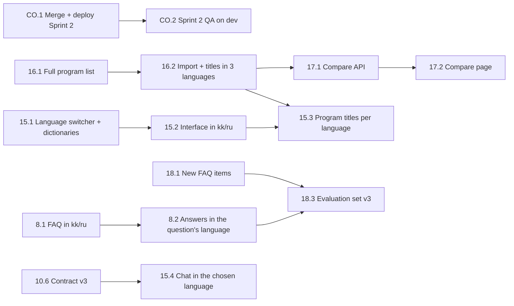

# Sprint 3 — team tasks

**Sprint:** 03.10 – 09.10.2026, review and retro on Friday 09.10.

**Sprint goal:** an applicant can use the portal and the assistant in Kazakh, Russian or English, find every SDU program (not a demo subset), compare up to three programs side by side, and rarely gets the "could not find" answer — with Sprint 2 accepted on the deployed dev environment.

**Stories:** US8 Multilingual Assistant, US15 Portal in Kazakh, Russian and English, US16 Full Program Catalogue, US17 Program Comparison, US18 Expanded FAQ Base, plus the Sprint 2 carry-over (dev run of US10–US14). Story cards are rows in `docs/table.xlsx`; acceptance scenarios are below.

## Team

| Person      | Role                              | Owns this sprint                                         |
| ----------- | --------------------------------- | -------------------------------------------------------- |
| Askhat      | Product Owner & developer         | US8, story acceptance, admissions office contact         |
| Dinmukhamed | Backend developer                 | US16                                                     |
| Serdar      | AI/IS developer                   | US18, chat API contract v3                               |
| Daniyar     | Scrum Master & frontend developer | US15, Sprint 2 carry-over, sprint process                |
| Nurmek      | Developer                         | US17                                                     |

## Where we are (09.10.2026)

- Built and checked locally (also on the full Docker stack): US17, US15, US16, US8, US18 and contract v3. QA records `backend/docs/qa/US8-QA.md`, `US16-QA.md` … `US18-QA.md`; review, decisions and retro in [sprint-3-review.md](sprint-3-review.md).
- Pull requests are stacked on the Sprint 2 ones: US17 → US15 → contract v3 → US16 → US8/US18.
- Open: the dev deployment and every QA run on dev (Sprint 2 and 3), branch protection, PO.5 (send the request to the admissions office).

## Data decision (Product Owner, 08.10.2026)

The admissions office has not sent the PO.3 texts yet. Every SDU page is published in English, Russian and Kazakh (`hreflang` twins on sdu.edu.kz), and the fee orders list every program with its code and fee. Sprint 3 therefore uses these **official published texts**, each with a source link and a verbatim quote, marked "pending admissions office review" — the same rule as Sprint 1. Nothing is translated by the team except interface labels (buttons, headings), which are not admission facts. When the office sends its texts, they replace the published ones.

## Critical path

## Tasks per person

### Askhat — Product Owner & developer

| ID   | Story | Task | What has to be done | Est., h | Depends on | Done when |
| ---- | ----- | ---- | ------------------- | ------- | ---------- | --------- |
| 8.1  | US8   | FAQ in Kazakh and Russian | For each FAQ item add the question and answer from the official RU and KZ page of its source, with a verbatim quote; index all three languages. | 4 | — | Every item has RU/KK text or a recorded reason why the official page lacks it. |
| 8.2  | US8   | Answers in the question's language | Detect the question's language (Kazakh, Russian, English); the word-for-word answer, the fallback, checklist and catalogue answers come in that language; the model is told to answer in it. | 4 | 8.1 | "Жатақхана қанша тұрады?" and "Сколько стоит общежитие?" get the dormitory item in Kazakh and Russian. |
| 8.3  | US8   | US8 QA | Kazakh and Russian cases of the evaluation set pass; run US8QATest on dev. | 1 | 8.2, 18.3 | QA result written down. |
| PO.4 | —     | Sprint 3 review and acceptance | Accept stories only when their QATest passes on dev; record carry-over. | 1 | all | Acceptance and carry-over recorded. |
| PO.5 | US8, US15, US16 | Send PO.3 request | Send the request drafted in `docs/sprint-2-review.md`; replace published texts when the office answers. | 0.5 | — | Request sent, date recorded. |

### Dinmukhamed — Backend developer

| ID   | Story | Task | What has to be done | Est., h | Depends on | Done when |
| ---- | ----- | ---- | ------------------- | ------- | ---------- | --------- |
| 16.1 | US16  | Full official program list | Every 2026–2027 bachelor, master and PhD program from the fee orders and program pages: code, titles in three languages, school, language, fee per ECTS, deadlines, page; evidence per field. | 5 | — | All programs listed; every empty value explained. |
| 16.2 | US16  | Import the full catalogue | Migration for `title_ru`, `title_kk`; the import shares one official document list per degree level and applicant type instead of repeating it; the API returns the titles. | 3 | 16.1 | Re-runnable import; programs without a published list keep the missing-data warning. |
| 16.3 | US16  | Catalogue at full size | Result count, school/degree/language filters and the empty state work with the full list; the catalogue export for the office review covers every program. | 2 | 16.2 | US16QATest passes. |

### Serdar — AI/IS developer

| ID   | Story | Task | What has to be done | Est., h | Depends on | Done when |
| ---- | ----- | ---- | ------------------- | ------- | ---------- | --------- |
| 10.6 | US10  | Chat API contract v3 | Remove the v1 fields `source_link`, `faq_id`, `similarity_score` from `/ask` and the stream (announced for Sprint 3); add `title` to each source so the widget can name catalogue pages. | 2 | — | Contract doc and `openapi.json` updated; widget uses only `sources`. |
| 18.1 | US18  | New official FAQ items | At least 25 new items from sdu.edu.kz on topics applicants ask about and the FAQ lacks, with source, quote and RU/KK text. | 5 | — | Items merged, pending office review. |
| 18.2 | US18  | Unanswered questions report | Script that groups the logged unanswered questions of the last N days for the office and the FAQ backlog. | 1 | — | Report lists questions with counts, no personal data. |
| 18.3 | US18  | Evaluation set v3 | Add cases for the new items and the Kazakh/Russian versions; compare with v2. | 2 | 18.1, 8.2 | Accuracy, fallbacks and invented facts documented. |

### Daniyar — Scrum Master & frontend developer

| ID   | Story | Task | What has to be done | Est., h | Depends on | Done when |
| ---- | ----- | ---- | ------------------- | ------- | ---------- | --------- |
| CO.1 | US10–14 | Merge and deploy Sprint 2 | Review and merge #11 → #12 → #13, deploy to dev, set `GEMINI_API_KEY` in Render. | 1 | — | Dev runs Sprint 2. |
| CO.2 | US10–14 | Sprint 2 QA on dev | US10–US14 QATests, `run_accuracy_test.py`, `check_catalogue_answers.py` and `frontend/e2e/widget-qa.mjs` against dev. | 2 | CO.1 | Results in the QA records; Sprint 2 accepted or carried over. |
| 15.1 | US15  | Language switcher | Kazakh / Russian / English switch in the header, kept across visits; `<html lang>` follows it; no new dependency. | 2 | — | Switching changes every label on the page. |
| 15.2 | US15  | Interface in three languages | All interface labels of the catalogue, program page, checklist and chat in kk/ru/en. | 3 | 15.1 | No English label left in kk/ru. |
| 15.3 | US15  | Program titles per language | Catalogue and program page show the official title of the chosen language, English when it is not published. | 1 | 16.2 | Titles follow the switch. |
| 15.4 | US15  | Chat in the chosen language | Starter questions in the chosen language; contract v3 sources. | 2 | 10.6, 8.1 | Kazakh starters get Kazakh answers. |
| 15.5 | US15  | QA | US15QATest and the widget regression in three languages, Chrome and Firefox, 360/768/1280 px. | 1 | 15.2–15.4 | Results written down. |
| SM.6 | — | Sprint 3 stand-ups, review and retro | As in Sprint 2. | — | — | Carry-over and retro recorded. |

### Nurmek — Developer

| ID   | Story | Task | What has to be done | Est., h | Depends on | Done when |
| ---- | ----- | ---- | ------------------- | ------- | ---------- | --------- |
| 17.1 | US17  | Compare API | `GET /api/programs/compare?ids=a,b,c`: 2–3 active programs in the requested order with their facts and document counts; clear errors for unknown, repeated or too many ids. | 2 | — | Contract documented and tested. |
| 17.2 | US17  | Compare page | "Compare" on program cards and pages (up to 3, kept in the session), a compare bar, and `/compare` with fee, language, deadlines, school and documents side by side; stacked on phones. | 4 | 17.1 | Works at 360 px; empty values say "Not published". |
| 17.3 | US17  | QA | US17QATest in Chrome and Firefox. | 1 | 17.2 | Results written down. |

## Acceptance scenarios (QATest, short form)

| Story | Pass | Fail case |
| ----- | ---- | --------- |
| US8 | "Жатақхана қанша тұрады?" → Kazakh answer from the dormitory item with its source; "Нужно ли сдавать ЕНТ?" → Russian answer | A Kazakh or Russian question answered in another language, or a fact missing from the official RU/KZ page |
| US15 | Switching to Қазақша changes every label, the program titles and the chat starters, and survives a reload | An English label left in the Kazakh interface |
| US16 | Filtering by master shows every official master program with fee and language; a program without a published list shows the warning | A program from the fee order missing from the catalogue |
| US17 | Three programs compared side by side with fee, language, deadlines and documents; works at 360 px | A fourth program can be added, or an empty value is shown as a number |
| US18 | The 40 v2 questions keep their score and the new topics are answered with their sources | Any invented fact in the evaluation set v3 |

## Definition of Done (every task)

Unchanged from Sprint 2: merged through a reviewed pull request with green CI; a database change has a migration and tests; an API change updates its contract, `openapi.json` and the frontend in the same pull request; only official admissions data; accepted only on dev.
