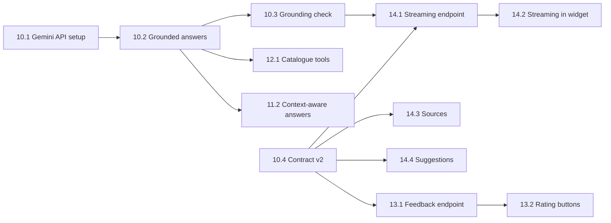

# Sprint 2 — team tasks

**Sprint:** 26.09 – 02.10.2026, review and retro on Friday 02.10.

**Sprint goal:** the chat assistant answers in its own words from official sources (Gemini Flash, free tier), remembers the conversation, answers program facts from the catalogue, streams answers with suggested questions and collects ratings — all running on the deployed dev environment.

**Stories:** US10 Grounded AI Answers, US11 Follow-up Questions in Context, US12 Catalogue Facts in the Chat, US13 Answer Feedback, US14 Streaming Answers and Suggested Questions. Story cards and QA scenarios are in `docs/table.xlsx`.

## Team

| Person      | Role                                 | Owns this sprint                                             |
| ----------- | ------------------------------------ | ------------------------------------------------------------ |
| Askhat      | Product Owner & developer            | US12, story acceptance, admissions office contact            |
| Dinmukhamed | Backend developer                    | US11, streaming endpoint (US14)                              |
| Serdar      | AI/IS developer                      | US10, chat API contract v2                                   |
| Daniyar     | Scrum Master & frontend developer    | US14, chat widget parts of US11 and US13, sprint process     |
| Nurmek      | Developer                            | US13                                                         |

**Role change (01.10.2026):** Daniyar took over the Scrum Master role from Nurmek. Both keep their development work; only the process duties moved.

## Where we are (01.10.2026)

- Sprint 1 is done: the dev environment is deployed, the QA scenarios passed there and the admissions office checked the catalogue, checklists and FAQ.
- No Sprint 2 code is merged yet. PR #9 (keyword-based tuition answers) was merged on 25.09; US12 replaces it with catalogue tools.
- One working day is left. At the review the Scrum Master and the Product Owner decide what moves to Sprint 3.

## Critical path

Unblock first: **10.1** (API key) and **10.4** (contract v2, already overdue — it was due on day 2).

## LLM: Gemini, free tier

Gemini's free tier is used for dev and for the deployed site — no billing account, no money spent. Free limits are per model, so when one model hits its limit the next one answers: Gemini Flash → another free Gemini model → the Sprint 1 word-for-word FAQ answer.

## Tasks per person

### Askhat — Product Owner & developer

| ID   | Story | Task                           | What has to be done                                                                                                                                                                                                                   | Est., h | Depends on      | Done when                                                                                       |
| ---- | ----- | ------------------------------ | ------------------------------------------------------------------------------------------------------------------------------------------------------------------------------------------------------------------------------------- | ------- | --------------- | ----------------------------------------------------------------------------------------------- |
| 12.1 | US12  | Catalogue tools for the assistant | Give the model two tools backed by the catalogue service: `search_programs(query, degree_level, language, faculty)` and `get_program(program_id)`. Fee, deadline, language and faculty answers link the program page. Replace the keyword tuition intent from PR #9 and move its test questions into the evaluation set (10.5). | 5       | 10.2            | Program fact questions are answered from the catalogue with a program link; PR #9 questions still pass. |
| 12.2 | US12  | Unknown values and comparison  | Empty catalogue fields are answered as "not published yet" with the office contact. "Compare X and Y" is answered side by side.                                                                                                        | 2       | 12.1            | No number is ever given for an empty field; a two-program comparison shows fee, language and both deadlines. |
| 12.3 | US12  | Catalogue answer check         | Check the 12 programs × fee, deadline and language questions against the catalogue; run US12QATest on dev.                                                                                                                            | 2       | 12.2            | All checks match the catalogue; US12QATest result written down.                                 |
| PO.2 | —     | Sprint review and acceptance   | Accept a story only when its QATest scenarios pass on dev. Decide the carry-over with the Scrum Master.                                                                                                                               | 1       | all             | Accepted and carried-over stories recorded in the backlog.                                      |
| PO.3 | US8, US15, US16 | Sprint 3 inputs      | Request from the admissions office: official Kazakh and Russian FAQ texts, program titles in three languages, the full program list with document lists.                                                                             | 1       | —               | Request sent; expected delivery date known before Sprint 3 planning.                            |

**Total:** 11 h

### Dinmukhamed — Backend developer

| ID   | Story | Task                      | What has to be done                                                                                                       | Est., h | Depends on  | Done when                                                                        |
| ---- | ----- | ------------------------- | ------------------------------------------------------------------------------------------------------------------------- | ------- | ----------- | -------------------------------------------------------------------------------- |
| 11.1 | US11  | Chat turn storage         | `chat_turn` table (session_id, role, text, sources, created_at) with migration and tests; daily deletion of turns older than 30 days. | 3       | —           | Migration merged; turns are stored and old turns are deleted.                    |
| 11.2 | US11  | Context-aware answers     | Pass the last 6 turns to the answer service; carry the program and applicant type from earlier turns into document and fee questions. | 4       | 11.1, 10.2  | "…for 6B06102 as a local applicant?" then "and as international?" returns the international list. |
| 11.3 | US11  | US11 tests and QA         | Integration tests for follow-ups and session isolation; run US11QATest on dev.                                            | 2       | 11.2        | Tests green; no answer ever uses another session's context; QA result written down. |
| 14.1 | US14  | Streaming endpoint        | `POST /api/assistant/ask/stream` with server-sent events: text chunks, then sources and answer_id; same fallbacks and time budget as `/ask`. | 4       | 10.3, 10.4  | Endpoint streams on dev; fallbacks behave as in `/ask`; contract documented.     |

**Total:** 13 h

### Serdar — AI/IS developer

| ID   | Story | Task                         | What has to be done                                                                                                                                                                         | Est., h | Depends on | Done when                                                                                       |
| ---- | ----- | ---------------------------- | ------------------------------------------------------------------------------------------------------------------------------------------------------------------------------------------- | ------- | ---------- | ----------------------------------------------------------------------------------------------- |
| 10.1 | US10  | Gemini API setup             | Free Google AI Studio key, no billing account. The ordered list of free Gemini models to fall back through, timeout and fallback settings in the settings and `.env.example`. The key goes only into the Render environment. | 2       | —          | A test call from dev returns an answer; the key is not in the repository. |
| 10.2 | US10  | Grounded answer generation   | Retrieve the top 5 FAQ items and send them with the question to Gemini with the rule: answer only from these sources, cite the faq_ids used, otherwise say you do not know. Keep the threshold fallback before any model call. | 6       | 10.1       | Combined questions get one answer that cites every FAQ item used.                               |
| 10.3 | US10  | Grounding check and fallbacks | Reject answers without a valid cited faq_id or with numbers or dates not found in the cited items. When a model hits its free limit, try the next model; on API error, timeout or all limits reached return the Sprint 1 word-for-word answer. Log model, tokens and latency. | 4       | 10.2       | A model at its limit is replaced by the next one; with the API key removed the assistant still answers from the FAQ; invented numbers never pass. |
| 10.4 | US10  | Chat API contract v2         | Add `sources [{faq_id, question, link}]` and `answer_id` to the ask response (keep `source_link` for one sprint) and a suggestions endpoint; update `assistant.md` and `openapi.json`. **Overdue — agree with Daniyar first thing.** | 2       | —          | Contract merged and confirmed by Daniyar.                                                       |
| 10.5 | US10  | Evaluation set v2            | Extend the accuracy set from 30 to 40 questions: combined questions, follow-ups, Kazakh/Russian wording, prompt-injection attempts, the PR #9 tuition questions. Score sources, fallbacks and invented facts; compare with Sprint 1 on dev. | 3       | 10.3       | Accuracy and failure list documented; zero invented facts.                                      |

**Total:** 17 h

### Daniyar — Scrum Master & frontend developer

Scrum Master duties:

| ID   | Task                              | What has to be done                                                                                                                                       | Done when                                                       |
| ---- | --------------------------------- | --------------------------------------------------------------------------------------------------------------------------------------------------------- | --------------------------------------------------------------- |
| SM.1 | Handover from Nurmek              | Take over the board, meeting slots and open process items from Nurmek.                                                                                   | Daniyar runs the next stand-up.                                 |
| SM.2 | Daily stand-up and board          | 15-minute stand-up; every task on the board has an owner and a status; blockers (10.1, 10.4) are chased the same day.                               | Board matches reality every day.                                |
| SM.3 | Branch protection (open since Sprint 1) | With the repository owner, protect `main`: pull request required, one approval, `Backend CI / test` and `Frontend CI / build` checks (`docs/repository-rules.md`). | A failing check blocks a merge.                                 |
| SM.4 | Open contract confirmations       | Confirm the programs contract (`backend/docs/api/programs.md`) and the assistant contract (T3.5), then contract v2 with Serdar.                            | All three marked confirmed in their docs.                       |
| SM.5 | Review and retro on 02.10         | Run the review (demo on dev) and the retro; with the Product Owner record the carry-over to Sprint 3 in the backlog.                                      | Carry-over and retro actions written down.                      |

Development:

| ID   | Story | Task                       | What has to be done                                                                                                                 | Est., h | Depends on        | Done when                                                                    |
| ---- | ----- | -------------------------- | ----------------------------------------------------------------------------------------------------------------------------------- | ------- | ----------------- | ---------------------------------------------------------------------------- |
| 11.4 | US11  | New conversation button    | Button in the widget that starts a new session_id and clears the dialogue.                                                           | 1       | —                 | After a new conversation, follow-ups no longer use the earlier program.      |
| 13.2 | US13  | Rating buttons             | Thumbs up and down under each assistant message, reason picker on thumbs down, rating kept in the session store.                    | 2       | 13.1              | One rating per answer; the rating survives navigation.                       |
| 14.2 | US14  | Streaming in the widget    | Render chunks as they arrive; typing indicator until the first chunk; 10 s timeout counted to the first chunk; abort on close; an interrupted answer gets a resend action. | 4       | 14.1              | Closing mid-answer never leaves a broken message.                            |
| 14.3 | US14  | Sources and formatting     | Render several sources per answer and lists such as document checklists (contract v2); note under the input: "Do not enter personal data". | 2       | 10.4              | Multi-source answers and checklists render correctly at 360 px.              |
| 14.4 | US14  | Suggested questions        | 4 starter questions from the suggestions endpoint and up to 3 follow-up chips after an answer.                                       | 3       | 10.4              | Clicking a suggestion sends it and gets a sourced answer.                    |
| 14.5 | US14  | Browser and device QA      | US14QATest and a widget regression in Chrome and Firefox at 360, 768 and 1280 px on dev.                    | 2       | 14.2–14.4         | Results written down for both browsers.                                      |

**Total:** 14 h development + Scrum Master duties

**Development status (02.10.2026):** 11.4, 13.2, 14.2, 14.3 and 14.4 are in the chat widget. Chrome checks for 14.5 are in `backend/docs/qa/US14-QA.md`. Firefox at the same widths is still open. Scrum Master duties SM.1–SM.5 stay with Daniyar for the review.

### Nurmek — Developer

| ID   | Story | Task                          | What has to be done                                                                                                                       | Est., h | Depends on | Done when                                                                        |
| ---- | ----- | ----------------------------- | ----------------------------------------------------------------------------------------------------------------------------------------- | ------- | ---------- | -------------------------------------------------------------------------------- |
| 13.1 | US13  | Feedback storage and endpoint | `answer_feedback` table with migration; `POST /api/assistant/feedback` (answer_id, rating, reason); one rating per answer; contract documented. | 3       | 10.4       | Thumbs down with reason "outdated" is stored with the answer and its sources.    |
| 13.3 | US13  | Negative feedback export      | Script that exports thumbs-down answers of the last N days to CSV for the Product Owner.                                                   | 1       | 13.1       | Export lists the last 7 days.                                                    |
| 13.4 | US13  | US13 QA on dev                | Run US13QATest on dev.                                                                                                                     | 1       | 13.2       | QA result written down.                                                          |
| SM.1 | —     | Hand over Scrum Master duties | Pass the board, meeting slots and open process items to Daniyar.                                                                           | 0.5     | —          | Daniyar runs the next stand-up.                                                  |

**Total:** 5.5 h

## Definition of Done (every task)

- Merged through a pull request with one review and green `Backend CI` / `Frontend CI`.
- A database change has an Alembic migration and tests.
- An API change updates its Markdown contract, `openapi.json` and the frontend in the same pull request.
- Only official admissions data; unknown values stay "not specified".
- A story is accepted only when its QATest scenarios pass on the dev environment, not on a local machine.
